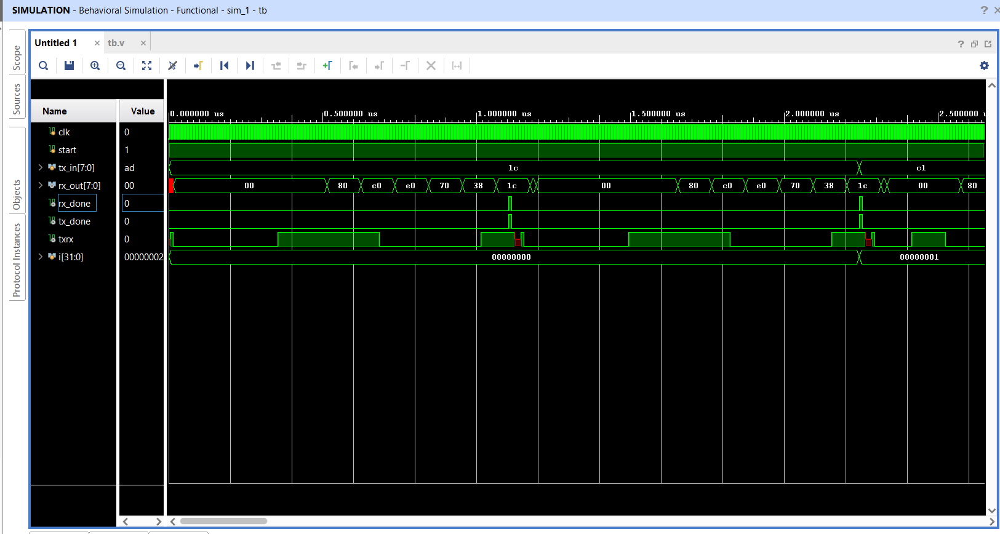

# UART Implementation in Verilog (Spartan-7 SP701)

## Overview
This repository contains a UART (Universal Asynchronous Receiver Transmitter)
implementation written in Verilog and targeted for the Xilinx Spartan-7
SP701 evaluation board.

The design includes both UART transmitter and receiver logic, verified
through simulation and successfully taken through synthesis, implementation,
and bitstream generation in Vivado.

---

## Features
- Baud rate: 9600
- Data bits: 8
- Parity: None
- Stop bits: 1
- Separate TX and RX finite state machines
- Parameterized baud-rate generator
- Designed for Spartan-7 (xc7s100fgga676-2)

---

## Design Details
- TX and RX implemented as independent FSMs
- Baud-rate timing derived from system clock using a counter
- Start and stop bit framing compliant with standard UART protocol
- Loopback-style simulation testbench used for verification

---

## Verification

### Simulation
- Functional verification performed using a self-checking testbench
- TX output looped back to RX input
- Random 8-bit data transmitted and received
- `rx_out` compared against `tx_in`
- `tx_done` and `rx_done` flags observed for correctness

### Hardware
- Bitstream generation:  Successful
- FPGA programming:  Not tested yet
- On-board UART (USB-UART) testing planned as a future step

---

## Waveforms & Results

### UART Simulation Waveform
The waveform below shows correct UART transmission and reception,
including start bit, data bits, and stop bit.



### Synthesized Design
The synthesized design confirms successful RTL synthesis without errors.


---

## Project Structure
```text
UART/
├── src/
│   └── uart.v          # UART RTL implementation
├── constraints/
│   └── uart.xdc        # Pin constraints for SP701
├── tb/
│   └── tb.v            # UART testbench
├── docs/
│   ├── simulation_waveform.png
│   └── synthesized_design.png
├── README.md
└── .gitignore
